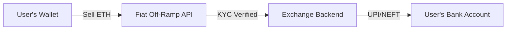
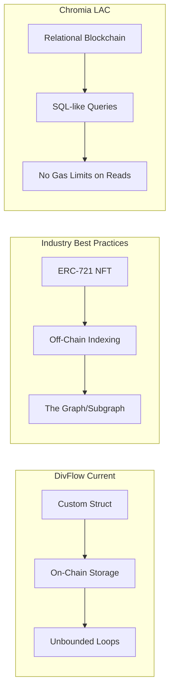
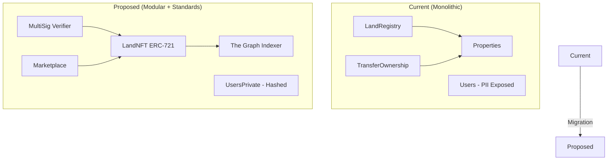

# DivFlow-Web3 Bottleneck Analysis

## Project Overview

DivFlow-Web3 is a decentralized land registry system built with:
- **Smart Contracts**: 4 Solidity contracts (Foundry/Anvil)
- **Frontend**: Next.js 14 with wagmi/viem for Web3 integration
- **State Management**: React Query (TanStack Query)

> [!NOTE]
> **Hackathon Context**: This is a hackathon project with a **20-day deadline**.
> - Running on **local Anvil blockchain** (not mainnet)
> - ERC-721/OpenSea integration is NOT applicable for local chains
> - Fiat conversion (INR) requires third-party payment gateway integration
> - Focus should be on **demonstrable features** over production-ready architecture

---

## 🔴 Critical Bottlenecks

### 1. O(n) Loops in Smart Contracts (Gas Cost Explosion)

> [!CAUTION]
> These loops will cause **exponentially increasing gas costs** as data grows, potentially making transactions fail.

#### [LandRegistry.sol:L170-177](file:///c:/Users/Lenovo/Desktop/Udbhav/DivFlow-Web3-Upgrade/contracts/src/LandRegistry.sol#L170-177) - `transferOwnership()`
```solidity
for (uint256 i = 0; i < propertiesOfOldOwner.length; i++) {
    if (propertiesOfOldOwner[i] == _propertyId) {
        propertiesOfOldOwner[i] = propertiesOfOldOwner[propertiesOfOldOwner.length - 1];
        propertiesOfOldOwner.pop();
        break;
    }
}
```
**Impact**: If a user owns 100+ properties, every transfer becomes expensive.

#### [TransferOfOwnership.sol:L226-231](file:///c:/Users/Lenovo/Desktop/Udbhav/DivFlow-Web3-Upgrade/contracts/src/TransferOfOwnership.sol#L226-231) - `acceptBuyerRequest()`
```solidity
for (i = 0; i < requestedUsers[sale.saleId].length; i++) {
    if (requestedUsers[sale.saleId][i].user == _buyer) { ... }
}
```
**Impact**: Same loop pattern repeated in `rerequestPurchaseRequest()`, `transferOwnerShip()`.

#### [TransferOfOwnership.sol:L346-352](file:///c:/Users/Lenovo/Desktop/Udbhav/DivFlow-Web3-Upgrade/contracts/src/TransferOfOwnership.sol#L346-352) - Nested loop in `transferOwnerShip()`
```solidity
for (i = 0; i < propertiesOnSale.length; i++) {
    if (propertiesOnSale[i] == sale.saleId) { ... }
}
```
**Impact**: Double iteration per transfer - one for buyer lookup, one for sale removal.

---

### 2. Missing Access Controls on Properties.sol

> [!WARNING]
> All state-changing functions in `Properties.sol` are `public` without access modifiers.

| Function | Risk |
|----------|------|
| `addLand()` | Anyone can add fake properties |
| `removeLand()` | Anyone can delete properties |
| `updateLand()` | Anyone can modify property data |
| `changeStateToVerifed()` | Anyone can bypass verification |
| `updateOwner()` | Anyone can change ownership |

**Current Design**: Relies on LandRegistry being the only caller, but the contract itself has no enforcement.

---

### 3. N+1 Query Problem in Frontend

> [!IMPORTANT]
> The "My Sales" page makes one additional contract call **per sale item** shown.

#### [my-sales/page.tsx:L26-34](file:///c:/Users/Lenovo/Desktop/Udbhav/DivFlow-Web3-Upgrade/frontend/src/app/marketplace/my-sales/page.tsx#L26-34)
```typescript
// Parent: Fetches ALL sales
const { data: allSales } = useReadContract({ functionName: "getAllSales" });

// Each SaleItem component (L87-92):
const { data: requests } = useReadContract({
    functionName: "getRequestedUsers",
    args: [sale.saleId],
});
```

**Impact**: 10 sales = 11 RPC calls. 100 sales = 101 RPC calls.

---

## 🟠 Scalability Concerns

### 4. Unbounded Array Growth

| Contract | Array | Risk |
|----------|-------|------|
| `TransferOfOwnership` | `Sales[] private sales` | Never cleaned up |
| `TransferOfOwnership` | `requestedSales[address]` | Accumulates forever |
| `LandRegistry` | `propertiesOfOwner[address][]` | Even sold properties tracked |
| `LandRegistry` | `propertiesControlledByRevenueDept[uint][]` | Never pruned |

**Note**: Completed sales stay in the array forever - `getAllSales()` returns historical data too.

---

### 5. Frontend Filters All Data Client-Side

#### [marketplace/page.tsx:L32](file:///c:/Users/Lenovo/Desktop/Udbhav/DivFlow-Web3-Upgrade/frontend/src/app/marketplace/page.tsx#L32)
```typescript
const sales = (allSales as any[])?.filter((sale: any) => sale.state === 0);
```

#### [my-sales/page.tsx:L32-34](file:///c:/Users/Lenovo/Desktop/Udbhav/DivFlow-Web3-Upgrade/frontend/src/app/marketplace/my-sales/page.tsx#L32-34)
```typescript
const mySales = (allSales as any[])?.filter(
    (sale: any) => address && sale.owner.toLowerCase() === address.toLowerCase()
);
```

**Impact**: Downloads ALL sales data even if user only needs 5 active listings.

---

### 6. Payment Deadline Too Short

#### [TransferOfOwnership.sol:L243](file:///c:/Users/Lenovo/Desktop/Udbhav/DivFlow-Web3-Upgrade/contracts/src/TransferOfOwnership.sol#L243)
```solidity
sale.deadlineForPayment = block.timestamp + 5 minutes;
```

**Risk**: Network congestion or wallet issues could cause legitimate buyers to miss deadline.

---

## 🟡 Minor Issues

### 7. No Data Cleanup After Successful Sales

The `transferOwnerShip()` function:
- ✅ Removes sale from `propertiesOnSaleByLocation`
- ❌ Does NOT remove from `sales[]` array
- ❌ Does NOT clean `requestedSales[]` for other buyers
- ❌ Commented-out cleanup code at L356-360

### 8. ABI Mismatch Between Contract and Frontend

#### Users.sol vs contracts.ts

Contract function:
```solidity
function registerUser(
    string memory _firstName,
    string memory _lastName,
    string memory _dateOfBirth,
    string memory _aadharNumber
)
```

Frontend ABI (L118-127):
```typescript
{ name: "_fname", type: "string" },  // Mismatched name
{ name: "_lname", type: "string" },  // Mismatched name
```

### 9. Missing Error Handling in Revenue Portal

#### [revenue/page.tsx:L52-54](file:///c:/Users/Lenovo/Desktop/Udbhav/DivFlow-Web3-Upgrade/frontend/src/app/revenue/page.tsx#L52-54)
```typescript
if (isConfirmed) {
    setTimeout(() => refetch(), 1000);  // No error handling, arbitrary delay
}
```

---

## 🐛 Potential Bugs

### Bug 1: Duplicate Purchase Requests Allowed

#### [TransferOfOwnership.sol:L169-193](file:///c:/Users/Lenovo/Desktop/Udbhav/DivFlow-Web3-Upgrade/contracts/src/TransferOfOwnership.sol#L169-193)

```solidity
function sendPurchaseRequest(uint256 _saleId, uint256 _priceOffered) public {
    // No check if user already sent a request
    requestedUsers[sale.saleId].push(...);
    requestedSales[msg.sender].push(sale.saleId);
}
```

**Bug**: Same buyer can send multiple purchase requests to the same sale, polluting arrays and confusing sellers.

---

### Bug 2: Stale Property References After Deletion

#### [Properties.sol:L75-78](file:///c:/Users/Lenovo/Desktop/Udbhav/DivFlow-Web3-Upgrade/contracts/src/Properties.sol#L75-78)

```solidity
function removeLand(uint256 _propertyId) public {
    require(lands[_propertyId].propertyId != 0, "Land does not exist");
    delete lands[_propertyId];
}
```

**Bug**: When a property is deleted:
- `propertiesOfOwner[owner][]` still contains the ID
- `propertiesControlledByRevenueDept[deptId][]` still contains it
- Dashboard will show deleted/empty properties

---

### Bug 3: Race Condition in Sale Acceptance

If seller accepts buyer A, buyer B's payment could theoretically execute first on-chain due to gas price differences.

#### Timeline:
1. Seller calls `acceptBuyerRequest(buyerA)` - in mempool
2. BuyerA sees acceptance, prepares payment
3. Attacker (or buyerB) front-runs with higher gas

**Mitigation**: The code does check `sale.acceptedFor == msg.sender` in `transferOwnerShip()`, but the 5-minute deadline creates a window for manipulation.

---

### Bug 4: Property State Not Checked When Listing for Sale

#### [TransferOfOwnership.sol:L110-121](file:///c:/Users/Lenovo/Desktop/Udbhav/DivFlow-Web3-Upgrade/contracts/src/TransferOfOwnership.sol#L110-121)

```solidity
function addPropertyOnSale(uint256 _propertyId, uint256 _price) public {
    require(msg.sender == propertiesContract.getLandDetailsAsStruct(_propertyId).owner, ...);
    require(propertiesContract.getLandDetailsAsStruct(_propertyId).state != Property.StateOfProperty.OnSale, ...);
    // Missing: Check if property is Verified!
}
```

**Bug**: Unverified or rejected properties can be listed for sale. Only checks if NOT already on sale.

---

### Bug 5: Value Display Shows Balance, Not Property Value

#### [dashboard/page.tsx:L39-43](file:///c:/Users/Lenovo/Desktop/Udbhav/DivFlow-Web3-Upgrade/frontend/src/app/dashboard/page.tsx#L39-43)

```typescript
const stats = [
    { label: "Total Properties", value: properties?.length ?? "0" },
    { label: "Total Value", value: balance ? `${balance.formatted} ${balance.symbol}` : "---" },
    //          ^^^ This is WALLET balance, not property value
];
```

**Bug**: "Total Value" shows the user's ETH wallet balance, not the sum of their property values. This is misleading UX.

---

### Bug 6: React Hydration Mismatch Risk

#### Components using `useState(false)` for mount check:
- [my-sales/page.tsx:L20-24](file:///c:/Users/Lenovo/Desktop/Udbhav/DivFlow-Web3-Upgrade/frontend/src/app/marketplace/my-sales/page.tsx#L20-24)
- [requested/page.tsx:L17-21](file:///c:/Users/Lenovo/Desktop/Udbhav/DivFlow-Web3-Upgrade/frontend/src/app/marketplace/requested/page.tsx#L17-21)

```typescript
const [mounted, setMounted] = useState(false);
useEffect(() => { setMounted(true); }, []);
if (!mounted) return null;
```

**Issue**: Returning `null` during SSR while rendering content client-side causes layout shift. The `dynamic` import with `{ ssr: false }` only applies to WalletConnect, not the whole page.

---

### Bug 7: Unchecked `propertyId === 0` Edge Case

#### Properties.sol mapping starts at ID 1:
```solidity
landCount++;
lands[landCount] = Land({ propertyId: landCount, ... });
```

But checks use `propertyId != 0`:
```solidity
require(lands[_propertyId].propertyId != 0, "Land does not exist");
```

**Edge Case**: If someone tries to access `lands[0]`, it returns a zeroed struct instead of throwing. This could mask errors.

---

### Bug 8: Sold Properties Remain in Owner's Array

When `transferOwnership()` moves property from seller to buyer:

```solidity
// Remove from old owner - OK
propertiesOfOldOwner[i] = propertiesOfOldOwner[length - 1];
propertiesOfOldOwner.pop();

// Add to new owner - OK
propertiesOfOwner[newOwner].push(_propertyId);
```

But `getPropertiesOfOwner()` still returns properties with `state == Bought`:

```solidity
properties[i] = propertiesContract.getLandDetailsAsStruct(propertyIds[i]);
// Returns property even if state is Bought (sold)
```

**Bug**: Dashboard shows "Bought" properties that were purchased, not sold, but the UI says "Verified" for state 5.

---

### Bug 9: `isConfirmed` State Persists Across Sales

#### [my-sales/page.tsx:L95](file:///c:/Users/Lenovo/Desktop/Udbhav/DivFlow-Web3-Upgrade/frontend/src/app/marketplace/my-sales/page.tsx#L95)

```typescript
const { isSuccess: isConfirmed } = useWaitForTransactionReceipt({ hash });
```

**Bug**: When a user accepts offer on Sale A, they see "Offer Accepted Successfully!" on ALL visible sales until the page refreshes. The `isConfirmed` boolean is per-component instance, but `hash` persistence causes stale success states.

---

### Bug 10: Reject Button Does Nothing

#### [revenue/page.tsx:L233-239](file:///c:/Users/Lenovo/Desktop/Udbhav/DivFlow-Web3-Upgrade/frontend/src/app/revenue/page.tsx#L233-239)

```tsx
<Button
    disabled={isConfirming}
    className="flex-1 bg-red-600/80 hover:bg-red-700 text-white"
    size="sm"
>
    Reject
</Button>
```

**Bug**: The "Reject" button has no `onClick` handler. Clicking it does nothing. The contract has `rejectProperty()` but it's not wired up.

---

## 🚨 User-Identified Issues (Critical for Hackathon)

### Bug 11: Duplicate Property Registration Allowed

> [!CAUTION]
> **Critical Fraud Vulnerability**: Same property can be registered multiple times!

Current `addLand()` has no uniqueness check on `locationId + surveyNumber`. A corrupt official can approve the same land twice, allowing it to be sold to multiple buyers.

**Fix Required**:
```solidity
mapping(bytes32 => bool) private propertyExists;

function addLand(...) public {
    bytes32 uniqueKey = keccak256(abi.encodePacked(_locationId, _revenueDepartmentId, _surveyNumber));
    require(!propertyExists[uniqueKey], "Property already registered");
    propertyExists[uniqueKey] = true;
    // ... rest
}
```

---

### Bug 12: Admin/Revenue Portal Visible to All Users

The `/admin` and `/revenue` routes are accessible to anyone. No role-based access control on frontend navigation.

**Fix**: Check wallet address against authorized roles before rendering admin routes.

---

### Bug 13: Slow First-Load (Cold Start Lag)

**Causes**: Cold contract reads, no prefetching, SSR hydration delay.

**Quick Fixes**: 
1. Add loading skeletons
2. Use `staleTime: 30000` in React Query
3. `prefetch` on Next.js Links

---

### Bug 14: Missing Property Details

Current display only shows numbers (Location ID, Survey Number, Area). Missing: property name, address, photos, documents.

**Fix**: Add `propertyName`, `physicalAddress` to struct. Use IPFS hash for photo metadata.

---

### Bug 15: No Role-Based UI Separation

Everyone sees the same interface. Need separate navigation for:
- **Customers**: Dashboard, Marketplace
- **Revenue Employees**: Verification Queue
- **Admin**: User/Department Management

---

## ❓ Open Questions & Answers (Research-Based)

### Q1: Where to Get Real Property Data for Demo?

**Found Datasets (FREE)**:

| Dataset | Records | Source | Content |
|---------|---------|--------|---------|
| **Kaggle House Price India** | 14,620 | kaggle.com | Bedrooms, bathrooms, area, price |
| **Magicbricks Dataset** | 27,900 | opendatabay.com | 91 variables, major cities |
| **Major Indian Cities** | 14,500 | opendatabay.com | Chennai, Mumbai, Bangalore, Delhi |

**How to Use**:
1. Download CSV from Kaggle: `House Price Dataset of India`
2. Write a seeding script to call `addLand()` for each row
3. Use random survey numbers and location IDs from the data

**Sample Seeding Script** (add to contracts folder):
```javascript
// seed_properties.js
const properties = require('./property_data.json');
// Loop and call addLand() for each property
```

---

### Q2: ETH to INR Bank Transfer - How Do Real Web3 Sites Do It?

> [!IMPORTANT]
> **Real crypto-to-fiat conversion uses "Fiat Off-Ramp" services**

**How It Works (Production)**:



**Services for India**:

| Provider | Integration | INR Support | Demo Friendly? |
|----------|-------------|-------------|----------------|
| **OnMeta** | Widget/API | ✅ UPI, IMPS | ⚠️ Needs API key |
| **Alchemy Pay** | SDK | ✅ UPI, IMPS | ⚠️ Production only |
| **Transak** | Widget | ✅ Yes | ⚠️ Needs sandbox |
| **Manual Demo** | Mock UI | ✅ Fake it | ✅ Best for hackathon |

**For Hackathon - RECOMMENDED APPROACH**:
1. Store property price in **INR** (not Wei)
2. Show "Payment: ₹50,00,000" in UI
3. Create a **mock payment flow**:
   - Button: "Pay via UPI"
   - Fake UPI QR code or input
   - On "success" → trigger blockchain transfer
4. In demo, explain: "In production, this integrates with OnMeta/Alchemy Pay"

**Dummy Bank Demo** (if needed):
- Use a simple form with bank details (fake)
- Show confirmation screen: "₹50,00,000 transferred to HDFC ****1234"
- This is purely UI - no actual integration

---

### Q3: How to Make It Truly Decentralized?

**Current Centralization Points**:
- ❌ Admin wallet controls employee mapping
- ❌ Single employee per department
- ❌ Contract owner has special powers

**Decentralization Strategies**:

| Level | Implementation | Complexity | For Hackathon? |
|-------|---------------|------------|----------------|
| **Multi-Sig Verification** | 2-of-3 verifiers must approve | Medium | ✅ Doable |
| **DAO Governance** | Token voting for admin changes | High | ❌ Too complex |
| **Timelock** | 24hr delay on admin actions | Low | ✅ Easy add |
| **Role-Based Access** | OpenZeppelin AccessControl | Medium | ✅ Recommended |

**Quick Win - Multi-Sig Verification**:
```solidity
// Instead of single verifier:
mapping(uint256 => mapping(address => bool)) approvals;
uint256 constant REQUIRED = 2;

function approveProperty(uint256 propertyId) public {
    require(isVerifier[msg.sender], "Not verifier");
    approvals[propertyId][msg.sender] = true;
    
    if (countApprovals(propertyId) >= REQUIRED) {
        propertiesContract.changeStateToVerified(propertyId);
    }
}
```

**For Hackathon Presentation**:
- Implement multi-sig verification (2-of-3)
- Mention: "Future: DAO governance with voting tokens"
- Show diagram of decentralized architecture

---

### Q4: OpenSea on Local Blockchain?

**Answer**: Not possible. OpenSea only indexes mainnet/testnets.

**For Hackathon**: 
- Focus on custom marketplace
- If you deploy to Sepolia testnet, OpenSea will index after ~24hrs
- Not worth the complexity for demo

---

## 📊 Summary Table

| Category | Issue | Severity | Fix Complexity |
|----------|-------|----------|----------------|
| **Bug** | Duplicate property registration allowed | 🔴 Critical | Low |
| **Privacy** | Aadhar stored as plaintext | 🔴 Critical | Medium |
| Gas | O(n) loops in transfers | 🔴 Critical | High |
| Security | No access control on Properties.sol | 🔴 Critical | Medium |
| Bug | Unverified properties can be listed | 🔴 Critical | Low |
| **UX** | Admin portal visible to all | 🟠 High | Low |
| **UX** | Missing property name/photos | 🟠 High | Medium |
| **UX** | No role-based UI separation | 🟠 High | Medium |
| Performance | N+1 query pattern | 🟠 High | Medium |
| Scalability | Unbounded arrays | 🟠 High | High |
| Bug | Duplicate purchase requests allowed | 🟠 High | Low |
| Bug | Stale property refs after deletion | 🟠 High | Medium |
| **Perf** | Slow first-load (cold start) | 🟡 Medium | Low |
| Bug | Reject button not functional | 🟡 Medium | Low |
| Bug | Dashboard shows wallet balance as "Value" | 🟡 Medium | Low |
| Bug | `isConfirmed` persists across sales | 🟡 Medium | Low |
| Performance | Client-side filtering | 🟡 Medium | Low |
| UX | 5-minute payment deadline | 🟡 Medium | Low |
| Data | No cleanup after sales | 🟡 Medium | Medium |
| Correctness | ABI parameter mismatch | 🟡 Medium | Low |
| Bug | Hydration mismatch risk | 🟢 Low | Low |
| Bug | PropertyId 0 edge case | 🟢 Low | Low |
| ~~Interop~~ | ~~No ERC-721~~ | N/A | N/A (local chain) |

---

## 🔐 Privacy Violation (NEW - From Industry Analysis)

> [!CAUTION]
> **PII Data Exposed on Public Blockchain** - This is a GDPR/Data Protection violation.

### Current Implementation (Users.sol)

```solidity
struct User {
    address userID;
    string firstName;      // ❌ Public PII
    string lastName;       // ❌ Public PII
    string dateOfBirth;    // ❌ Public PII
    string aadharNumber;   // ❌ CRITICAL - National ID exposed!
    uint256 accountCreatedDateTime;
}

mapping(address => User) public users;  // Anyone can read
```

**Risk**: Anyone can query `users[address]` and get the full Aadhar number, name, and DOB of any registered user.

### Industry Standard: Hash-Only Storage

Systems like **MahaRERA** and **Bitland** store only cryptographic hashes of identity documents.

---

## 🔗 Interoperability Gap (NEW - From Industry Analysis)

> [!WARNING]
> Land assets cannot be traded on OpenSea, seen in wallets, or used in DeFi.

### Current vs Standard

| Aspect | DivFlow (Current) | Industry Standard |
|--------|-------------------|-------------------|
| Token Format | Custom `Land` struct | ERC-721 NFT |
| Wallet Display | ❌ Not visible | ✅ Shows in MetaMask |
| Marketplace | ❌ Custom only | ✅ OpenSea, Rarible |
| DeFi | ❌ Cannot collateralize | ✅ Use as loan collateral |
| Transfer Standard | Custom function | `safeTransferFrom()` |

### Industry Examples

- **Propy**: Uses ERC-721 for all property deeds
- **Fabrica**: Strict ERC-721 + ERC-1155 for fractional ownership
- **RealT**: Tokenized real estate on Ethereum/Gnosis

---

## 🏭 Industry Comparison



| Platform | Privacy Approach | Scalability | Token Standard |
|----------|-----------------|-------------|----------------|
| **Chromia (LAC)** | Hashed IDs | Relational DB off-chain | Custom |
| **MahaRERA** | Hash-only storage | Centralized index | None |
| **Propy** | Minimal on-chain | The Graph indexing | ERC-721 |
| **Fabrica** | ZK Proofs | IPFS + indexer | ERC-721 |
| **DivFlow** | ❌ Plaintext PII | ❌ On-chain loops | ❌ Custom |

---

## 🛠️ Proposed Refactoring Solutions

### Solution 1: Privacy-Preserving Users.sol

**Option A: Keccak256 Hashing**

```solidity
// SPDX-License-Identifier: MIT
pragma solidity ^0.8.20;

contract UsersPrivate {
    struct User {
        address userID;
        bytes32 identityHash;  // keccak256(firstName + lastName + aadhar)
        bytes32 aadharHash;    // keccak256(aadharNumber) for uniqueness
        uint256 accountCreatedDateTime;
    }

    mapping(address => User) private users;  // Now private!
    mapping(bytes32 => bool) private aadharHashes;

    event UserRegistered(address indexed userID, bytes32 indexed identityHash);

    function registerUser(
        bytes32 _identityHash,
        bytes32 _aadharHash
    ) public {
        require(users[msg.sender].userID == address(0), "Already registered");
        require(!aadharHashes[_aadharHash], "Aadhar already registered");

        users[msg.sender] = User({
            userID: msg.sender,
            identityHash: _identityHash,
            aadharHash: _aadharHash,
            accountCreatedDateTime: block.timestamp
        });

        aadharHashes[_aadharHash] = true;
        emit UserRegistered(msg.sender, _identityHash);
    }

    // Verification: User provides raw data, we hash and compare
    function verifyIdentity(
        address _user,
        string memory _firstName,
        string memory _lastName,
        string memory _aadhar
    ) public view returns (bool) {
        bytes32 computedHash = keccak256(abi.encodePacked(_firstName, _lastName, _aadhar));
        return users[_user].identityHash == computedHash;
    }
}
```

**Option B: Zero-Knowledge Proof Integration**

For maximum privacy, integrate with a ZK system:
1. Use **Semaphore** for anonymous identity proofs
2. Use **Polygon ID** for verifiable credentials
3. Store only ZK commitment on-chain

---

### Solution 2: ERC-721 Land Token

```solidity
// SPDX-License-Identifier: MIT
pragma solidity ^0.8.20;

import "@openzeppelin/contracts/token/ERC721/ERC721.sol";
import "@openzeppelin/contracts/token/ERC721/extensions/ERC721URIStorage.sol";
import "@openzeppelin/contracts/access/AccessControl.sol";

contract LandNFT is ERC721URIStorage, AccessControl {
    bytes32 public constant VERIFIER_ROLE = keccak256("VERIFIER_ROLE");
    
    enum PropertyState { Created, Verified, Rejected, OnSale }
    
    struct LandMetadata {
        uint256 locationId;
        uint256 revenueDepartmentId;
        uint256 surveyNumber;
        uint256 area;
        PropertyState state;
        address verifiedBy;
    }
    
    mapping(uint256 => LandMetadata) public landData;
    uint256 private _tokenIdCounter;

    constructor() ERC721("DivFlow Land", "LAND") {
        _grantRole(DEFAULT_ADMIN_ROLE, msg.sender);
    }

    function registerLand(
        address owner,
        uint256 locationId,
        uint256 revenueDeptId,
        uint256 surveyNumber,
        uint256 area,
        string memory ipfsHash  // Metadata URI
    ) public returns (uint256) {
        _tokenIdCounter++;
        uint256 tokenId = _tokenIdCounter;
        
        _safeMint(owner, tokenId);
        _setTokenURI(tokenId, ipfsHash);
        
        landData[tokenId] = LandMetadata({
            locationId: locationId,
            revenueDepartmentId: revenueDeptId,
            surveyNumber: surveyNumber,
            area: area,
            state: PropertyState.Created,
            verifiedBy: address(0)
        });
        
        return tokenId;
    }

    function verifyProperty(uint256 tokenId) 
        public 
        onlyRole(VERIFIER_ROLE) 
    {
        require(_exists(tokenId), "Token does not exist");
        landData[tokenId].state = PropertyState.Verified;
        landData[tokenId].verifiedBy = msg.sender;
    }

    // Override transfer to add verification check
    function _beforeTokenTransfer(
        address from,
        address to,
        uint256 tokenId,
        uint256 batchSize
    ) internal virtual override {
        super._beforeTokenTransfer(from, to, tokenId, batchSize);
        
        // Only verified properties can be transferred (except minting)
        if (from != address(0)) {
            require(
                landData[tokenId].state == PropertyState.Verified,
                "Property not verified"
            );
        }
    }

    function supportsInterface(bytes4 interfaceId)
        public view override(ERC721URIStorage, AccessControl)
        returns (bool)
    {
        return super.supportsInterface(interfaceId);
    }
}
```

**Benefits of ERC-721:**
- ✅ Visible in MetaMask/wallets
- ✅ Tradeable on OpenSea, Blur
- ✅ Can be used as DeFi collateral
- ✅ Standard `ownerOf()`, `transferFrom()` functions
- ✅ Events indexed by The Graph automatically

---

### Solution 3: Decentralized Revenue Department Verification

Current centralized model:
```
Admin → mapRevenueDeptIdToEmployee(deptId, singleEmployee)
```

Proposed multi-sig threshold model:

```solidity
contract MultiSigVerification {
    uint256 public constant REQUIRED_APPROVALS = 2;
    
    struct VerificationRequest {
        uint256 propertyId;
        uint256 approvalCount;
        bool executed;
        mapping(address => bool) hasApproved;
    }
    
    mapping(uint256 => address[]) public deptVerifiers;
    mapping(bytes32 => VerificationRequest) public requests;
    
    function addVerifier(uint256 deptId, address verifier) 
        public onlyAdmin 
    {
        deptVerifiers[deptId].push(verifier);
    }
    
    function approveVerification(uint256 propertyId) public {
        bytes32 requestId = keccak256(abi.encodePacked(propertyId));
        VerificationRequest storage req = requests[requestId];
        
        require(!req.hasApproved[msg.sender], "Already approved");
        require(isVerifier(propertyRevenueDept[propertyId], msg.sender), "Not a verifier");
        
        req.hasApproved[msg.sender] = true;
        req.approvalCount++;
        
        if (req.approvalCount >= REQUIRED_APPROVALS && !req.executed) {
            req.executed = true;
            // Call LandNFT.verifyProperty()
        }
    }
}
```

**Benefits:**
- No single point of failure
- Requires consensus (2-of-N verifiers)
- Audit trail of who approved

---

## 📈 Recommended Architecture Migration



### Migration Roadmap

| Phase | Task | Effort |
|-------|------|--------|
| 1 | Hash existing user data, deploy `UsersPrivate` | 1 week |
| 2 | Deploy `LandNFT`, migrate existing properties | 2 weeks |
| 3 | Set up The Graph subgraph for indexing | 1 week |
| 4 | Update frontend to use ERC-721 + subgraph | 1 week |
| 5 | Implement multi-sig verification | 1 week |

---

## Quick Fixes (Low Effort)

### Smart Contracts

1. **Use mappings instead of arrays** for O(1) lookups:
   ```solidity
   mapping(address => mapping(uint256 => bool)) propertyOwnership;
   mapping(uint256 => uint256) propertyIndex; // For removal
   ```

2. **Add access modifiers to Properties.sol**:
   ```solidity
   modifier onlyLandRegistry() {
       require(msg.sender == landRegistryAddress, "Unauthorized");
       _;
   }
   ```

3. **Implement pagination** for view functions:
   ```solidity
   function getSales(uint256 offset, uint256 limit) public view returns (Sales[] memory)
   ```

### Frontend

1. **Batch contract calls** with multicall:
   ```typescript
   import { useContractReads } from 'wagmi';
   ```

2. **Add query caching** with stale-while-revalidate:
   ```typescript
   query: { staleTime: 30_000 }
   ```

3. **Implement virtual scrolling** for large lists.

4. **Use The Graph** for complex queries instead of on-chain loops.
