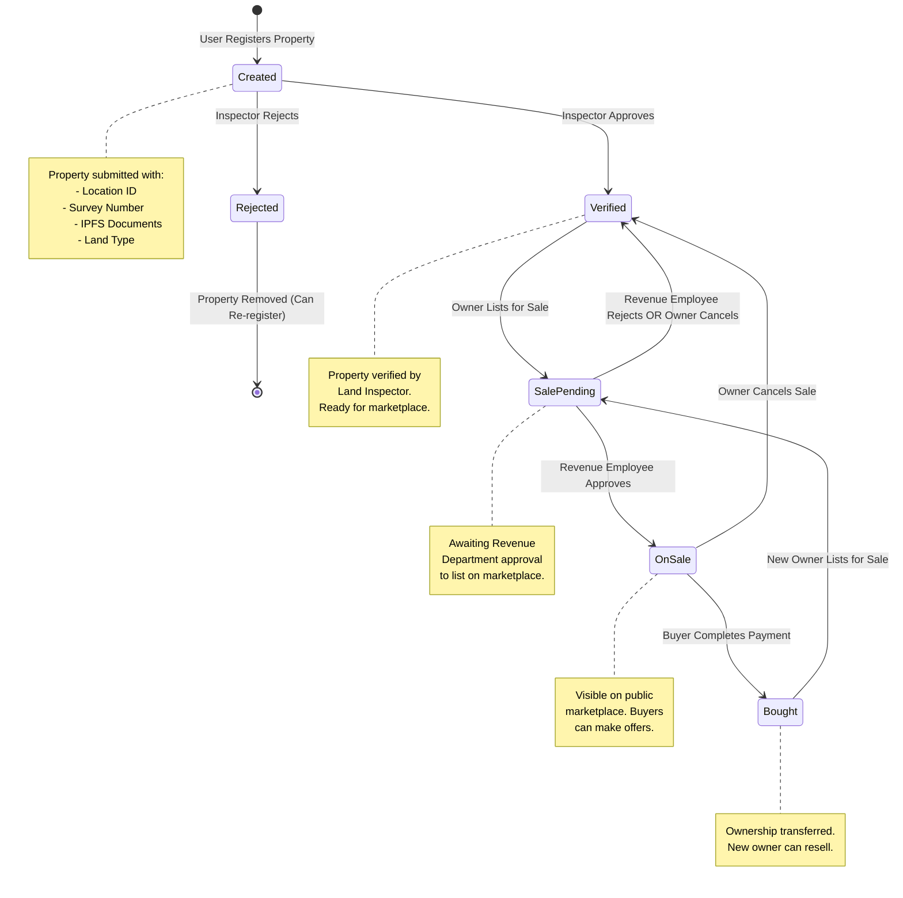

# Property State Machine Diagram

```mermaid
stateDiagram-v2
    [*] --> Created: User Registers Property

    Created --> Verified: Inspector Approves
    Created --> Rejected: Inspector Rejects

    Rejected --> [*]: Property Removed (Can Re-register)

    Verified --> SalePending: Owner Lists for Sale
    
    SalePending --> OnSale: Revenue Employee Approves
    SalePending --> Verified: Revenue Employee Rejects OR Owner Cancels

    OnSale --> Verified: Owner Cancels Sale
    OnSale --> Bought: Buyer Completes Payment

    Bought --> SalePending: New Owner Lists for Sale

    note right of Created
        Property submitted with:
        - Location ID
        - Survey Number  
        - IPFS Documents
        - Land Type
    end note

    note right of Verified
        Property verified by
        Land Inspector.
        Ready for marketplace.
    end note

    note right of SalePending
        Awaiting Revenue
        Department approval
        to list on marketplace.
    end note

    note right of OnSale
        Visible on public
        marketplace. Buyers
        can make offers.
    end note

    note right of Bought
        Ownership transferred.
        New owner can resell.
    end note
```
