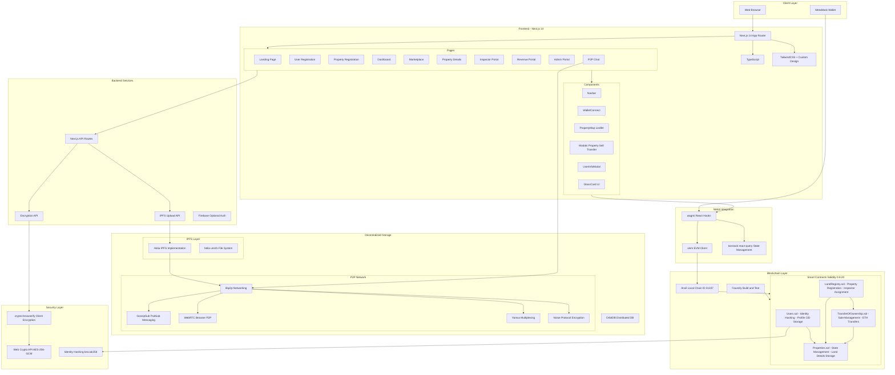

# System Architecture Diagram

```mermaid
flowchart TB
    subgraph Client["Client Layer"]
        Browser["Web Browser"]
        MetaMask["MetaMask Wallet"]
    end

    subgraph Frontend["Frontend - Next.js 14"]
        NextJS["Next.js 14 App Router"]
        TypeScript["TypeScript"]
        TailwindCSS["TailwindCSS + Custom Design"]
        
        subgraph Pages["Pages"]
            Landing["Landing Page"]
            Register["User Registration"]
            RegisterLand["Property Registration"]
            Dashboard["Dashboard"]
            Marketplace["Marketplace"]
            PropertyDetails["Property Details"]
            InspectorPage["Inspector Portal"]
            RevenuePage["Revenue Portal"]
            AdminPage["Admin Portal"]
            ChatPage["P2P Chat"]
        end
        
        subgraph Components["Components"]
            Navbar["Navbar"]
            WalletConnect["WalletConnect"]
            PropertyMap["PropertyMap Leaflet"]
            Modals["Modals Property Sell Transfer"]
            UserInfoModal["UserInfoModal"]
            GlassCard["GlassCard UI"]
        end
    end

    subgraph Web3Layer["Web3 Integration"]
        Wagmi["wagmi React Hooks"]
        Viem["viem EVM Client"]
        TanstackQuery["tanstack react-query State Management"]
    end

    subgraph Blockchain["Blockchain Layer"]
        subgraph SmartContracts["Smart Contracts Solidity 0.8.20"]
            Users["Users.sol - Identity Hashing - Profile CID Storage"]
            LandRegistry["LandRegistry.sol - Property Registration - Inspector Assignment"]
            Properties["Properties.sol - State Management - Land Details Storage"]
            TransferOwnership["TransferOfOwnership.sol - Sale Management - ETH Transfers"]
        end
        
        Anvil["Anvil Local Chain ID 31337"]
        Foundry["Foundry Build and Test"]
    end

    subgraph Storage["Decentralized Storage"]
        subgraph IPFSLayer["IPFS Layer"]
            Helia["Helia IPFS Implementation"]
            UnixFS["helia unixfs File System"]
        end
        
        subgraph P2PNetwork["P2P Network"]
            libp2p["libp2p Networking"]
            GossipSub["GossipSub PubSub Messaging"]
            WebRTC["WebRTC Browser P2P"]
            Yamux["Yamux Multiplexing"]
            Noise["Noise Protocol Encryption"]
        end
        
        OrbitDB["OrbitDB Distributed DB"]
    end

    subgraph Backend["Backend Services"]
        NextAPI["Next.js API Routes"]
        IPFSUpload["IPFS Upload API"]
        EncryptionAPI["Encryption API"]
        Firebase["Firebase Optional Auth"]
    end

    subgraph Security["Security Layer"]
        CryptoBrowserify["crypto-browserify Client Encryption"]
        WebCrypto["Web Crypto API AES-256-GCM"]
        IdentityHash["Identity Hashing keccak256"]
    end

    Browser --> NextJS
    MetaMask --> Wagmi
    
    NextJS --> TypeScript
    NextJS --> TailwindCSS
    NextJS --> Pages
    Pages --> Components
    
    Components --> Wagmi
    Wagmi --> Viem
    Wagmi --> TanstackQuery
    
    Viem --> Anvil
    Anvil --> SmartContracts
    
    Users --> Properties
    LandRegistry --> Properties
    LandRegistry --> TransferOwnership
    TransferOwnership --> Properties
    
    Pages --> NextAPI
    NextAPI --> IPFSUpload
    NextAPI --> EncryptionAPI
    IPFSUpload --> Helia
    
    Helia --> libp2p
    libp2p --> GossipSub
    libp2p --> WebRTC
    libp2p --> Yamux
    libp2p --> Noise
    
    ChatPage --> libp2p
    
    EncryptionAPI --> CryptoBrowserify
    CryptoBrowserify --> WebCrypto
    Users --> IdentityHash
    
    Foundry --> SmartContracts
```
