# Use Case Diagram - DivFlow Land Registry

```mermaid
flowchart TB
    %% Define Actors on left side
    Admin((Admin))
    Inspector((Inspector))
    Revenue((Revenue))
    
    %% Define Actors on right side  
    Citizen((Citizen))
    Buyer((Buyer))

    subgraph System[DivFlow Land Registry System]
        direction TB
        
        %% Core Use Cases
        UC_Register([Register Account])
        UC_ConnectWallet([Connect Wallet])
        
        UC_RegisterProperty([Register Property])
        UC_UploadDocs([Upload Documents])
        UC_TrackStatus([Track Property Status])
        
        UC_VerifyProperty([Verify Property])
        UC_RejectProperty([Reject Property])
        
        UC_RequestSale([Request Sale Listing])
        UC_ApproveSale([Approve Sale])
        UC_RejectSale([Reject Sale])
        
        UC_BrowseMarket([Browse Marketplace])
        UC_MakeOffer([Make Purchase Offer])
        UC_AcceptOffer([Accept Offer])
        UC_Payment([Complete ETH Payment])
        UC_Transfer([Transfer Ownership])
        
        UC_ViewProfile([View User Profile])
        UC_ViewHistory([View Property History])
        
        UC_AssignInspector([Assign Inspector])
        UC_AssignRevenue([Assign Revenue Employee])
        
        %% Include/Extend Relationships
        UC_RegisterProperty -.->|includes| UC_UploadDocs
        UC_VerifyProperty -.->|includes| UC_ViewProfile
        UC_ApproveSale -.->|includes| UC_ViewProfile
        UC_AcceptOffer -.->|includes| UC_Payment
        UC_Payment -.->|includes| UC_Transfer
        UC_RequestSale -.->|extends| UC_TrackStatus
    end

    %% Admin Connections
    Admin --> UC_AssignInspector
    Admin --> UC_AssignRevenue

    %% Inspector Connections
    Inspector --> UC_VerifyProperty
    Inspector --> UC_RejectProperty
    Inspector --> UC_ViewProfile

    %% Revenue Connections
    Revenue --> UC_ApproveSale
    Revenue --> UC_RejectSale
    Revenue --> UC_ViewProfile

    %% Citizen/Owner Connections
    Citizen --> UC_Register
    Citizen --> UC_ConnectWallet
    Citizen --> UC_RegisterProperty
    Citizen --> UC_TrackStatus
    Citizen --> UC_RequestSale
    Citizen --> UC_AcceptOffer
    Citizen --> UC_ViewHistory

    %% Buyer Connections
    Buyer --> UC_Register
    Buyer --> UC_ConnectWallet
    Buyer --> UC_BrowseMarket
    Buyer --> UC_MakeOffer
    Buyer --> UC_Payment
    Buyer --> UC_ViewHistory

    %% Styling
    style System fill:#f5f5f5,stroke:#333,stroke-width:2px
    style Admin fill:#e1f5fe,stroke:#0288d1
    style Inspector fill:#fff3e0,stroke:#f57c00
    style Revenue fill:#e8f5e9,stroke:#388e3c
    style Citizen fill:#fce4ec,stroke:#c2185b
    style Buyer fill:#f3e5f5,stroke:#7b1fa2
```

## Legend

| Symbol | Meaning |
|--------|---------|
| `(( ))` | Actor (circle) |
| `([ ])` | Use Case (stadium/oval) |
| `-->` | Actor uses this use case |
| `-.->` includes | Use case always includes another |
| `-.->` extends | Use case optionally extends another |
